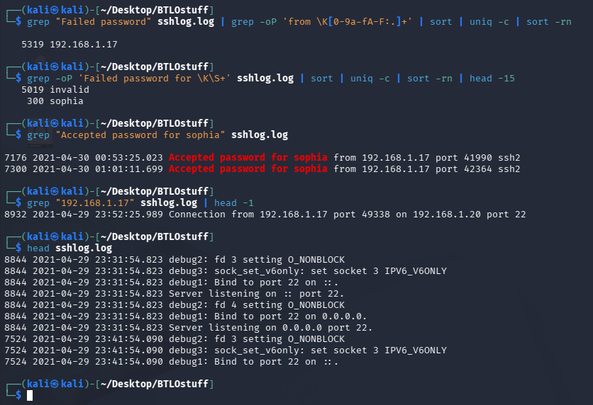
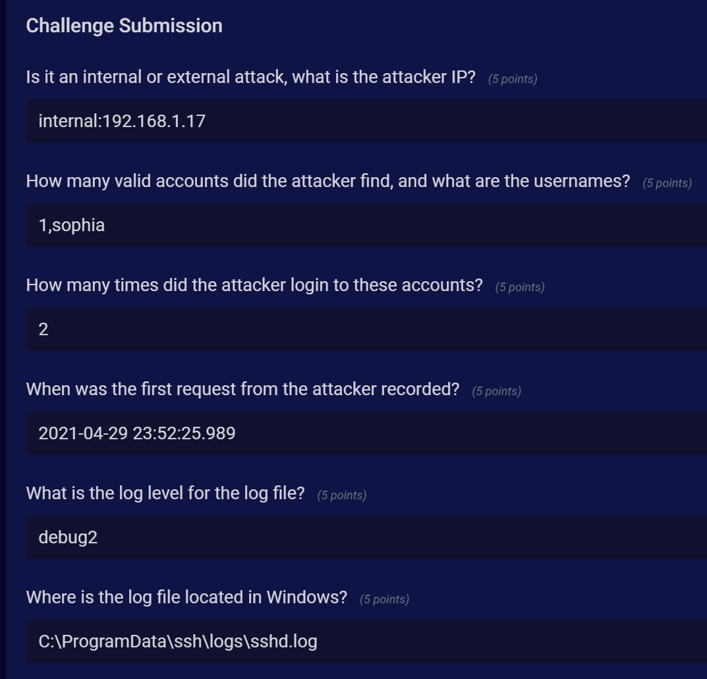

# SSH Log Analysis

**Platform:** Blue Team Labs Online  
**Category:** Security Operations  
**Difficulty:** Easy  
**Date Completed:** 2025-XX-XX

---

## Scenario

> Hey! We had a SSH service on a system and noticed unusual change in size of the log file. Don't panic, it was the new IT guys' daughter who said she was able to break into the system. I had given her permission to test some of these services. I am giving you the log file, can you solve the following queries?

## Objective

Analyze the provided `sshlog.log` to reconstruct the brute-force attack: identify the attacker, which accounts were compromised, and metadata about the log itself.

## Tools Used

- Kali Linux
- grep, sort, uniq (CLI log analysis)

---

## Analysis

### Initial Triage

Filtering for failed and accepted authentication events reveals a single source IP responsible for the vast majority of failed logins, indicating an automated brute-force attempt.

### Finding 1 — Attacker IP

Grepping "Failed password" and extracting source IPs shows `192.168.1.17` with 5319 failures — a private (RFC1918) address, so the attack originated internally.



### Finding 2 — Valid Account Discovery

Filtering failed attempts by username, `invalid` accounts dominate (5019), but `sophia` appears 300 times as a *valid* user (no "invalid user" tag). Grepping "Accepted password for sophia" confirms two successful logins.

### Finding 3 — Successful Logins

```
7176  2021-04-30 00:53:25.023  Accepted password for sophia from 192.168.1.17 port 41990 ssh2
7300  2021-04-30 01:01:11.699  Accepted password for sophia from 192.168.1.17 port 42364 ssh2
```

### Finding 4 — First Attacker Request

Grepping the attacker IP and taking the first hit gives the earliest connection.

```
8932  2021-04-29 23:52:25.989  Connection from 192.168.1.17 port 49338 on 192.168.1.20 port 22
```

### Finding 5 — Log Level

`head sshlog.log` shows `debug2` entries, confirming the configured LogLevel.

---



## Question Walkthrough

**Q1: Is it an internal or external attack, what is the attacker IP?**  
**Answer:** `internal:192.168.1.17`  
The source IP is a private RFC1918 address, so the attack is internal.

**Q2: How many valid accounts did the attacker find, and what are the usernames?**  
**Answer:** `1,sophia`  
Failed-login username analysis showed `sophia` as the only valid (non-"invalid user") account targeted.

**Q3: How many times did the attacker login to these accounts?**  
**Answer:** `2`  
Two "Accepted password for sophia" entries from the attacker IP.

**Q4: When was the first request from the attacker recorded?**  
**Answer:** `2021-04-29 23:52:25.989`  
Earliest log entry containing the attacker IP.

**Q5: What is the log level for the log file?**  
**Answer:** `debug2`  
Confirmed from the log entries' debug level.

**Q6: Where is the log file located in Windows?**  
**Answer:** `C:\ProgramData\ssh\logs\sshd.log`  
Default OpenSSH-for-Windows log path.

---

## IOCs

| Type | Value |
|------|-------|
| SHA256 | |
| Domain / IP | 192.168.1.17 (attacker), 192.168.1.20 (target) |
| Account | sophia |
| File / Path | C:\ProgramData\ssh\logs\sshd.log |

## Analyst Notes

Automated SSH brute-force from an internal host against user `sophia`, resulting in credential compromise and two authenticated sessions.

MITRE ATT&CK:
- T1110.001 – Brute Force: Password Guessing
- T1078 – Valid Accounts

A defender should alert on high volumes of failed SSH auth from a single source followed by a success (spray-then-hit pattern), and on the abnormal log-file size growth noted in the scenario.

## Key Takeaways

- Distinguishing "invalid user" vs. valid-user failures isolates which accounts actually exist and were targeted.
- Simple grep/sort/uniq pipelines are enough to fully reconstruct an SSH brute-force kill chain.
